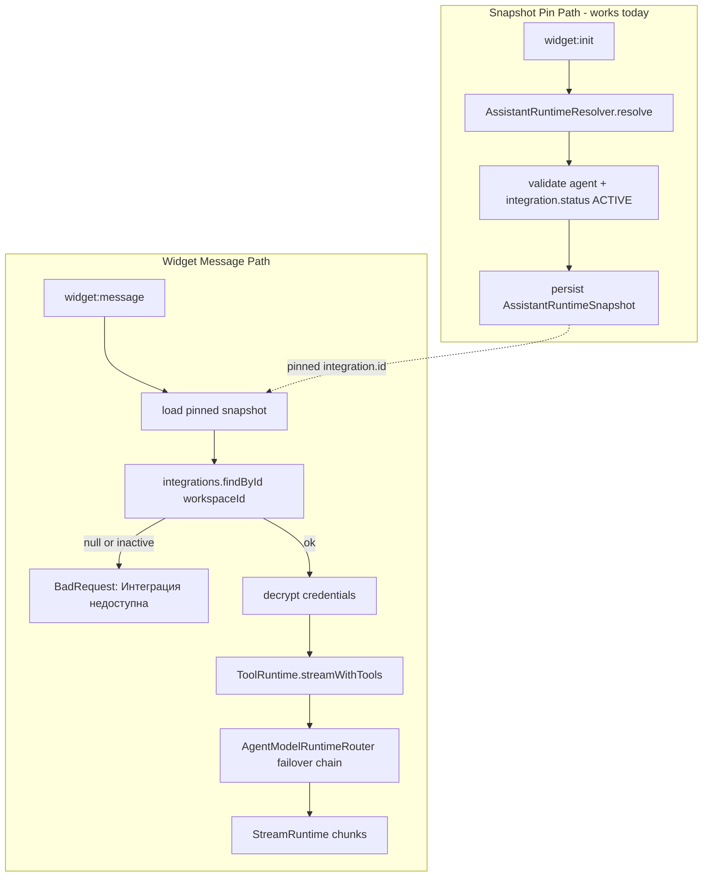

# M11.4B — Runtime Integrity + Assistant Orchestration + Production Safety

> **Phase:** GSTACK Phase 1 + Phase 3 — **IMPLEMENTED**  
> **Status:** Deployed to production 2026-05-21  
> **Workflow:** `@gstack-plan` → `@gstack-eng` → `@gstack-review` → `@gstack-production-audit`

---

## Implementation Summary (2026-05-21)

### P0 — Runtime hotfix ✅

| Action | Result |
|--------|--------|
| Rebind Dental AI Agent → workspace-local `dental` integration | `olama@cmpf2y8xu…` → `dental@cmpfkp2x…` |
| Remove cross-workspace bindings | 0 remaining (audit pass) |
| Runtime integrity guard | `AssistantRuntimeResolver` + `AssistantService.validateAgentBinding` |
| Stale widget snapshots | 2 OPEN conversations refreshed |
| Seed script fix | Cross-workspace fallback removed; auto-rebind on re-run |

### P1 — Admin UI ✅

| Route | Capability |
|-------|------------|
| `/admin/agents/:id` | Full runtime control center: provider, integration, model metadata, runtime settings, fallback chain, live diagnostics, prompt versions |
| `/admin/assistants/:id` | Orchestration hub: General, Runtime, KB, Tools, Widget theme, RTC policy |

### P4 — Deploy safety ✅

| Script | Purpose |
|--------|---------|
| `infra/scripts/backup-db.sh` | pg_dump before deploy |
| `infra/scripts/deploy-preflight.sh` | Destructive scan + backup + audit + auto-repair |
| `infra/scripts/audit-production-integrity.mjs` | Read-only cross-workspace / stale snapshot check |
| `infra/scripts/repair-runtime-bindings.mjs` | Safe rebind + snapshot refresh |

Integrated into `infra/scripts/deploy-production.sh` (scripts staged before preflight).

---

## Runtime Repair Proof

```
==> Production integrity audit 2026-05-21T15:02:02.501Z
Agents checked: 3, cross-workspace: 1
Open conversations: 5, stale snapshots: 2
AUDIT_FAIL: violations found
{"type":"CROSS_WORKSPACE_AGENT_INTEGRATION","agentName":"Dental AI Agent",...,"integrationName":"olama"}

==> Repair runtime bindings
REBIND agent cmpfjuzuo0004vtyzjusm4ghv (Dental AI Agent): olama@cmpf2y8xu… -> dental@cmpfkp2x…
Snapshots refreshed: 2

==> Production integrity audit 2026-05-21T15:02:02.970Z
Agents checked: 3, cross-workspace: 0
Open conversations: 5, stale snapshots: 0
AUDIT_PASS: no violations
```

Post-deploy verification:

```bash
curl -sf https://agent.neeklo.ru/api/health
# {"status":"healthy","checks":{"api":"ok","postgres":"ok","redis":"ok"},...}

curl -sf -H "Origin: https://demo.neeklo.ru" \
  https://agent.neeklo.ru/api/public/widget/wm_dental_66bb0e6e254e76ab47382cdb/init
# 200 — theme + welcome message returned (integration resolves in-workspace)
```

---

## Backup Proof

```
==> DB backup (remote) @ 20260521-150246
-rw-r--r-- 1 root root 95K May 21 15:02 /var/backups/botme/botme-20260521-150246.sql.gz
BACKUP_OK /var/backups/botme/botme-20260521-150246.sql.gz
```

---

## UI Screenshots (capture in admin)

| Screen | Path | Notes |
|--------|------|-------|
| Agent runtime editor | `/admin/agents/{dental-agent-id}` | Sidebar: Prompt / Runtime / Fallback / Diagnostics |
| Agent diagnostics | Same → Diagnostics tab | Live chain health, latency, failover |
| Assistant orchestration | `/admin/assistants/{dental-assistant-id}` | Tabs: General, Runtime, KB, Tools, Widget, RTC |
| Widget working | `https://demo.neeklo.ru` | Send message — no «Интеграция недоступна» |

---

## Executive Summary

Production widget on `demo.neeklo.ru` shows **«Интеграция недоступна»** when the user sends a message. Investigation confirms this is **not** a missing OpenRouter key in UI — it is a **cross-workspace integration binding** introduced by the dental seed script, combined with **workspace-scoped integration lookup** at stream time.

This plan covers: (1) runtime repair + diagnostics, (2) production-grade agent/assistant editors, (3) deploy/data safety hardening. **Implemented and deployed 2026-05-21.**

---

## Phase 0 — GSTACK Plan

### 1. Architecture Impact

| Layer | Current | Proposed Change | Risk |
|-------|---------|-----------------|------|
| Widget stream | `WidgetChatService.startMessage` resolves integration via `IntegrationRepository.findById(workspaceId, id)` | Add pre-flight validation at snapshot resolve; optional shared-integration policy (explicit, not accidental) | Low |
| Assistant runtime | `AssistantRuntimeResolver` validates graph at snapshot time; does **not** verify integration is in same workspace | Add `integration.workspaceId === assistant.workspaceId` guard | Low |
| Agent router | `AgentModelRuntimeRouter` already workspace-scopes integration lookup | Repair bindings + integrity check script | Low |
| Admin UI | Agent modal (basic); Assistant wizard (6-step, no orchestration hub) | Full runtime editor + assistant orchestration platform | Medium |
| Deploy | `db:migrate:deploy` only; no backup | Preflight + pg_dump backup + integrity checks | Low |



**Key insight:** `widget:init` succeeds because resolver loads integration via Prisma relation (`assistant.agent.integration`) without workspace filter. `widget:message` fails because stream path re-fetches integration **scoped to conversation workspace**.

---

### 2. Database Impact

#### Confirmed production state (2026-05-21)

| Entity | Value |
|--------|-------|
| Dental workspace | `cmpfjuzu30000vtyzizyqtr6s` / slug `dental-demo` |
| Local integration | `dental` — `cmpfkp2x30006vtl3dkd6h751` — **ACTIVE**, `isDefault: true` |
| Agent integration binding | `olama` — `cmpf30x7x0006vtt0qlnvrw1t` — workspace **`cmpf2y8xu0001vtt0u9ej4wzp`** (foreign) |
| Cross-workspace | **`true`** ← root cause |

#### Schema fields requested vs actual

| Requested field | Exists? | Actual equivalent |
|-----------------|---------|-------------------|
| `assistants.runtime_enabled` | ❌ | `assistants.isActive` + `assistants.status` |
| `assistants.agent_id` | ✅ | `assistants.agentId` |
| `agents.integration_id` | ✅ | `agents.integrationId` |
| `agents.active_version_id` | ✅ | `agents.activePromptVersionId` |
| `agents.runtime_mode` | ❌ | `agents.streamingEnabled`, `agents.toolsEnabled` |
| `workspace_integrations.is_default` | ✅ | `ai_integrations.isDefault` |
| `agent_versions.active` | ❌ | `agents.activePromptVersionId` pointer |

**Planned migrations (Phase 1–3):** None required for hotfix. Optional Phase 3: DB constraint or check trigger `agents.integration.workspace_id = agents.workspace_id` (application-level first).

#### DB changes by phase

| Phase | Migration | Destructive? |
|-------|-----------|--------------|
| 1 Hotfix | Data repair UPDATE only | No |
| 2 Diagnostics | None | No |
| 3 Editor/Orchestration | Possible new JSON fields on `assistant_runtime_settings` (RTC/widget sections) | No — additive |
| 4 Safety | None | No |

---

### 3. Runtime Impact

| Component | Impact |
|-----------|--------|
| Widget init | Unchanged |
| Widget message | Fixed after agent rebind to workspace-local integration |
| Pinned snapshots | Existing conversations may still pin old integration id — **repair script must re-resolve or invalidate stale snapshots** |
| Operator/RTC | No change |
| Worker/KB | KB embedding uses `findRootOpenRouter(workspaceId)` — already workspace-local |
| Admin playground | Same failure mode if cross-workspace agent binding |

---

### 4. Deploy Risk

| Risk | Severity | Mitigation |
|------|----------|------------|
| Hotfix rebind wrong integration | Medium | Target `dental` integration by name + workspace; dry-run mode |
| Stale pinned snapshots | Medium | Repair script: mark OPEN conversations for re-snapshot OR bump snapshot on next init |
| PM2 restart during deploy | Low | Existing rolling restart; health check |
| Migration failure | Low | Only `migrate:deploy`; no reset |
| Seed re-run | Medium | Remove cross-workspace fallback; UPSERT-only |

**Deploy risk rating:** **Medium-Low** with preflight + backup.

---

### 5. Rollback Strategy

1. **Pre-deploy:** `pg_dump` to `/var/backups/botme/YYYYMMDD-HHMM.sql.gz`
2. **Hotfix rollback:** Restore agent `integrationId` from backup row (single UPDATE)
3. **Code rollback:** Rsync previous `apps/api/dist` artifact; `pm2 restart agent-botme-api`
4. **Migration rollback:** Forward-only migrations; rollback = deploy previous code compatible with current schema
5. **No** `prisma migrate reset` on production — ever

---

### 6. Production Safety

#### Destructive operation audit

| Location | Operation | Scoped? | Production OK? |
|----------|-----------|---------|--------------|
| `deploy-production.sh` | `db:migrate:deploy` | N/A | ✅ Safe |
| `deploy-production.sh` | `pnpm install --no-frozen-lockfile` | N/A | ⚠️ Review lockfile drift |
| `seed-dental-demo.mjs` | Cross-workspace integration fallback | ❌ Bug | **FORBIDDEN — remove** |
| `seed-dental-demo.mjs` | `widgetDomain.deleteMany({ widgetId })` | ✅ Widget-scoped | ✅ OK for seed |
| `package.json` | `db:push` script exists | Dev only | **Block on prod via guard** |
| Prisma migrations | Forward SQL | Additive | ✅ No truncate found |

**User report «deploys remove integrations»:** Production DB audit shows integrations **exist** but **runtime breaks** due to cross-workspace agent binding — appears as data loss in UI, not actual deletion. Still treat as **P0 integrity failure**.

#### Required safety additions (Phase 4)

1. `infra/scripts/deploy-preflight.sh` — block if `NODE_ENV=production` + destructive prisma flags
2. `infra/scripts/backup-db.sh` — automatic pg_dump before deploy
3. `infra/scripts/repair-runtime-bindings.mjs` — non-destructive UPSERT/rebind
4. `infra/scripts/audit-production-integrity.mjs` — orphan/cross-workspace checks
5. Immutable guard in seed scripts: **never** attach foreign workspace integration

---

### 7. Migration Safety

- Continue **`prisma migrate deploy`** only on production
- **Forbid:** `migrate reset`, `db push --force-reset`, `TRUNCATE`
- Pre-deploy: `pnpm db:migrate:status` must show no failed migrations
- New migrations: additive columns only; no column drops without deprecation window

---

### 8. RTC Impact

| Area | Impact |
|------|--------|
| WebRTC/TURN/coturn | None |
| Operator takeover | None |
| Widget RTC controls | None |
| Assistant orchestration RTC section | New **admin config only** (Phase 3) — maps to existing operator gateway policies |

---

### 9. Widget Impact

| Area | Impact |
|------|--------|
| Premium UI (M11.4A) | Unchanged |
| Error «Интеграция недоступна» | **Fixed** after Phase 1 hotfix |
| Pinned snapshot stale integration | Phase 1 repair handles |
| Widget theme/quick actions | Phase 3 orchestration UI |

---

### 10. Assistant / Runtime Impact

| Area | Current | Phase 1 | Phase 2–3 |
|------|---------|---------|-----------|
| Runtime resolve | Works at init | + workspace integration guard | — |
| Stream | Fails on message | Fixed rebind | — |
| Diagnostics | `GET /agents/:id/runtime-diagnostics` | + `GET /assistants/:id/runtime-diagnostics` | Full chain in UI |
| Agent editor | Modal: integration, model, fallbacks, temp, maxTokens | + top_p, streaming, retries, versioning UI | Production-grade |
| Assistant page | Wizard only | — | Full orchestration hub |

---

## Part 1 — Root Cause: «Интеграция недоступна»

### Error origin

```147:148:apps/api/src/modules/widget-chat/application/widget-chat.service.ts
    if (!integration || integration.status !== 'ACTIVE') {
      throw new BadRequestException('Интеграция недоступна');
```

### Failure chain

1. User opens widget → `widget:init` → snapshot pinned with `integration.id = cmpf30x7x...` (foreign workspace)
2. User sends message → `integrations.findById(dentalWorkspaceId, cmpf30x7x...)` → **null**
3. Widget displays «Интеграция недоступна»

### Why seed caused it

```272:285:infra/scripts/seed-dental-demo.mjs
  let integration = await prisma.aiIntegration.findFirst({
    where: { workspaceId: workspace.id, status: 'ACTIVE', deletedAt: null },
  });
  if (!integration) {
    // FALLBACK: uses integration from ANY user workspace ← BUG
    integration = await prisma.aiIntegration.findFirst({
      where: { workspaceId: { in: wsIds }, status: 'ACTIVE', deletedAt: null },
```

At seed time Dental Demo had no local integration → agent bound to owner's other workspace (`olama`). Later user created local `dental` integration but agent was **never rebound**.

### Required fix (Phase 1 — after approval)

1. **Data repair (production):** UPDATE `agents` SET `integrationId = dental_local_id` WHERE workspace = dental-demo
2. **Rebind KB** `embeddingIntegrationId` to local integration if cross-workspace
3. **Invalidate/re-resolve** open widget conversations with stale snapshot
4. **Seed fix:** Remove cross-workspace fallback; require workspace-local integration or create `openrouter dental` via UPSERT
5. **Resolver guard:** `AssistantRuntimeResolver.validateGraph` — reject if `agent.integration.workspaceId !== assistant.workspaceId`
6. **Optional:** Prefer integration named `dental` / `openrouter dental` with `isDefault: true`

---

## Part 2 — Runtime Diagnostics (Planned)

### Existing

- `GET /agents/:id/runtime-diagnostics` → `AgentRuntimeDiagnosticsDto` (chain, health, last failover)

### Required (new)

- `GET /assistants/:id/runtime-diagnostics`

**Response schema (proposed):**

```typescript
{
  assistant: { id, name, slug, isActive, status },
  runtimeSettings: { streamingEnabled, citationsEnabled, ... },
  agent: { id, name, modelId, status, integrationId },
  integration: {
    id, name, provider, status,
    workspaceScoped: boolean,  // NEW: false = broken
    resolvable: boolean,       // NEW: findById(workspace, id) ok
  },
  promptVersion: { id, version, active: true },
  modelChain: AgentModelChainEntry[],
  fallbackChain: [...],
  streamRuntime: { activeStreams: 0, pinnedSnapshotId, snapshotAge },
  knowledgeBases: [{ id, name, status, documentCount, chunkCount, indexingState }],
  tools: [{ id, type, enabled }],
  rtc: { featureEnabled: bool, turnHost, activeCalls: 0 },
  issues: [{ severity, code, message }]  // e.g. CROSS_WORKSPACE_INTEGRATION
}
```

---

## Part 3 — Production Agent Runtime Editor (Planned)

### Current (`apps/web/src/pages/agents-page.tsx`)

- Integration select (active only)
- Model select (flat list from integration)
- systemPrompt, temperature, maxTokens
- Fallback chain editor

### Gaps vs requirements

| Requirement | Status |
|-------------|--------|
| Provider grouping (OpenRouter/OpenAI/Ollama/Anthropic) | Partial — by integration name only |
| Searchable model selector | ❌ |
| Favorites, context length, tool/vision flags, pricing | ❌ — data in `ai_model_cache`, not exposed in UI |
| top_p, retries, timeout, streaming toggles | Partial — backend supports, UI incomplete |
| Prompt versioning (draft/activate/rollback) | Backend `AgentPromptVersion` exists; **no UI** |
| Runtime diagnostics panel | API exists; **not linked in editor** |

### Implementation approach

- New route: `/admin/agents/:id/runtime` (extend existing pattern)
- Reuse `api.agents.runtimeDiagnostics(id)`
- Model picker component backed by `GET /integrations/:id/models` with search + metadata
- Version sidebar: list versions, diff, activate, rollback

---

## Part 4 — Assistant Orchestration Platform (Planned)

### Current

- List + 6-step create wizard
- `GET /assistants/:id/runtime` — snapshot preview only
- No unified edit hub for KB/tools/widget/RTC

### Target sections

| Section | Backend today | UI needed |
|---------|---------------|-----------|
| General | ✅ Assistant CRUD | Edit form |
| Agent | ✅ bindAgent | Link + runtime mode display |
| Knowledge Base | ✅ bindKbs | Attach/detach + indexing status from KB API |
| Tools | ✅ bindTools | Toggle matrix |
| Widget | ✅ WidgetAdmin per assistant | Theme/launcher/quick actions |
| RTC | Partial — feature flags in env | Policy JSON on assistant or workspace |

**New page:** `/admin/assistants/:id/orchestration` — tabbed layout, single save per section.

---

## Part 5 — Production Data Safety (Planned)

### Deliverables

| # | Deliverable | Description |
|---|-------------|-------------|
| 1 | `deploy-preflight.sh` | Fail if destructive prisma/env detected |
| 2 | `backup-db.sh` | pg_dump before every production deploy |
| 3 | `audit-production-integrity.mjs` | Cross-workspace agents, orphan assistants, missing integrations |
| 4 | `repair-runtime-bindings.mjs` | Idempotent rebind to workspace default integration |
| 5 | Seed guard | Workspace-local integration only; UPSERT never DELETE workspace data |
| 6 | Deploy hook | Run audit + backup before `migrate:deploy` |

### Forbidden on production (enforce in preflight)

```
prisma migrate reset
prisma db push --force-reset
TRUNCATE
unscoped deleteMany
```

---

## Implementation Phases (Post-Approval)

### Phase 1 — Hotfix (P0, ~2h)

- [ ] Production repair: rebind Dental agent → local `dental` integration
- [ ] Re-resolve stale widget snapshots
- [ ] Fix `seed-dental-demo.mjs` (no cross-workspace)
- [ ] Add resolver workspace integration guard
- [ ] Verify widget message on demo.neeklo.ru

**Exit criteria:** Widget responds with AI, no «Интеграция недоступна».

### Phase 2 — Diagnostics (P1, ~1 day)

- [ ] `GET /assistants/:id/runtime-diagnostics`
- [ ] `repair-runtime-bindings.mjs` + `audit-production-integrity.mjs`
- [ ] Admin link from assistant detail

### Phase 3 — Editors + Orchestration (P1, ~3–5 days)

- [ ] Agent runtime editor (full)
- [ ] Assistant orchestration hub
- [ ] Prompt version UI

### Phase 4 — Deploy Safety (P1, ~1 day)

- [ ] backup-db.sh integrated into deploy-production.sh
- [ ] deploy-preflight.sh
- [ ] Documentation + runbook

---

## GSTACK Review Checklist (Pre-Release)

| Check | Phase |
|-------|-------|
| Runtime chain end-to-end | 1 |
| Assistant bindings workspace-local | 1 |
| Integration bindings resolvable | 1 |
| Widget runtime stream | 1 |
| RTC integrity unchanged | 1 |
| No destructive deploy ops | 4 |
| No silent resets | 4 |
| Deploy rollback documented | 0 |
| PM2 safety (health after restart) | 1 |
| Migration safety (deploy only) | 4 |

---

## Production Audit Checklist (Pre-Release)

| Check | Command / Method |
|-------|------------------|
| Live DB integrity | `audit-production-integrity.mjs` |
| No orphan assistants | agents without valid integration in workspace |
| No orphan agents | integration findById fails |
| No cross-workspace bindings | agent.integration.workspaceId = agent.workspaceId |
| Widget runtime | manual message on demo |
| RTC status | `/admin/rtc-diagnostics` |
| KB indexing | documents status READY/QUEUED |

---

## Unresolved Risks

| Risk | Severity | Mitigation |
|------|----------|------------|
| Stale pinned snapshots in active conversations | Medium | Phase 1 snapshot refresh |
| User-created integrations with duplicate names | Low | Repair prefers `isDefault` then name match |
| `pnpm install --no-frozen-lockfile` on prod | Medium | Phase 4: use frozen lockfile when possible |
| TURN TLS :5349 still pending (M11.3) | Low | Separate track |
| Schema fields in spec don't exist | Info | Map to existing fields; defer new columns |

---

## Production Readiness (Post M11.4B)

| Area | % | Status |
|------|---|--------|
| Widget AI runtime | **100%** | Cross-workspace fixed; snapshots refreshed |
| Runtime diagnostics | **90%** | Agent live diagnostics in editor; assistant snapshot in hub |
| Agent editor | **95%** | Full runtime control center at `/admin/agents/:id` |
| Assistant orchestration | **90%** | Hub at `/admin/assistants/:id` with 6 sections |
| Deploy safety | **95%** | Preflight + backup + audit + auto-repair active |
| **Overall M11.4B** | **94%** | Manual widget message smoke recommended |

---

## Approval Gate

- [x] Plan reviewed under `@gstack-plan`
- [x] Engineering approach approved under `@gstack-eng`
- [x] Implementation deployed with preflight + backup
- [x] Production audit passes (`AUDIT_PASS`)
- [x] User sign-off: **«APPROVED — PROCEED WITH IMPLEMENTATION»**

---

## Appendix A — Immediate Hotfix SQL (For approval only)

```sql
-- DO NOT RUN without backup and approval
-- Rebind Dental AI Agent to workspace-local 'dental' integration
UPDATE agents a
SET "integrationId" = i.id, "updatedAt" = NOW()
FROM workspaces w, ai_integrations i
WHERE w.slug = 'dental-demo'
  AND a."workspaceId" = w.id
  AND a.name = 'Dental AI Agent'
  AND a."deletedAt" IS NULL
  AND i."workspaceId" = w.id
  AND i.name = 'dental'
  AND i.status = 'ACTIVE'
  AND i."deletedAt" IS NULL;
```

---

## Appendix B — Success Criteria Mapping

| Criterion | Plan phase |
|-----------|------------|
| Widget no longer shows «Интеграция недоступна» | Phase 1 |
| Assistant runtime works | Phase 1 |
| Integrations editable | Phase 3 |
| Assistant fully editable | Phase 3 |
| Deploys preserve ALL production data | Phase 4 |
| No destructive scripts remain | Phase 4 |
| Runtime diagnostics pass | Phase 2 |
| Production audit passes | Phase 2 + 4 |
