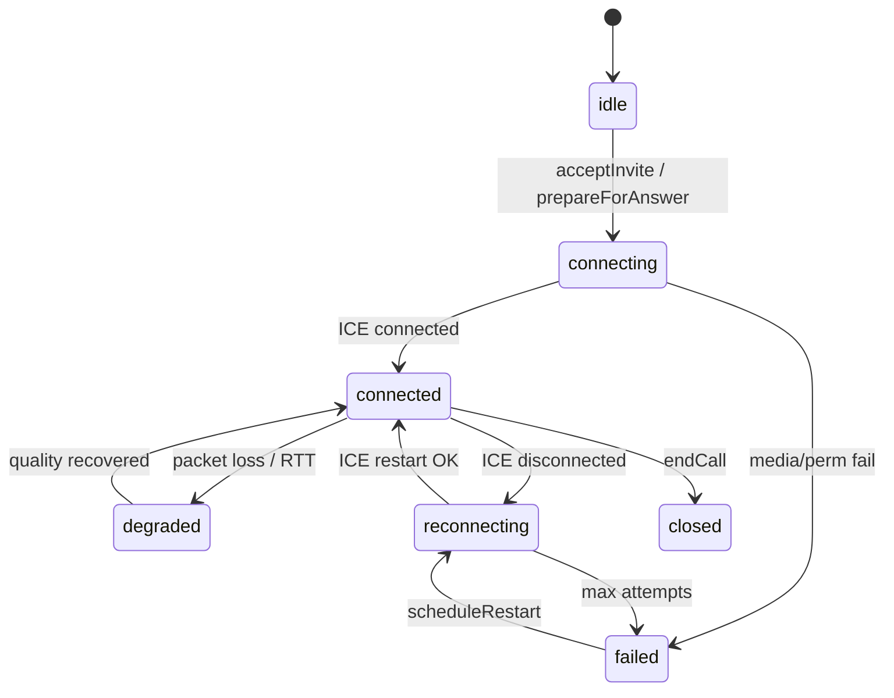
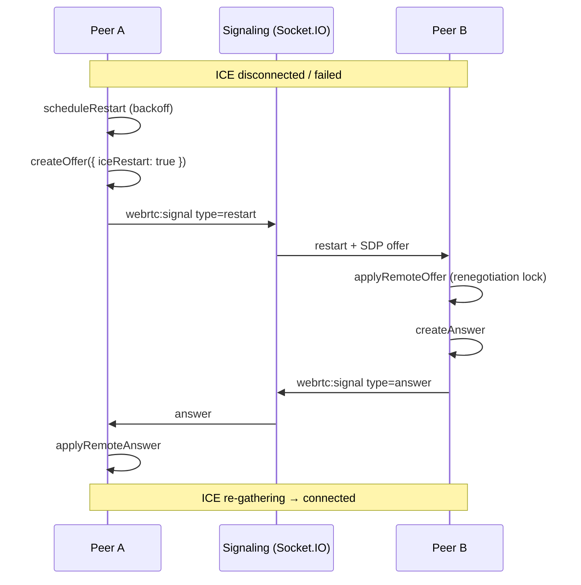

# M11.6 — Production RTC Reliability + Zero-Scroll Widget UI + Self-Healing Connection Layer

> **Workflow:** `@gstack-plan` → `@gstack-eng` → `@gstack-review` → `@gstack-rtc-audit` → `@gstack-network-audit` → `@gstack-ui-product-audit` → `@gstack-production-audit`  
> **Status:** Implemented 2026-05-21 — pending production QA sign-off

---

## Executive Summary

M11.6 closes the gap between “RTC infrastructure exists” and **production-grade calls + premium widget UX**.

| Priority | Problem | Fix |
|----------|---------|-----|
| P0 | Inner scrollbars, cramped textarea, raw call UI | Single scroll owner, hidden scrollbars, fixed footer, premium call overlay |
| P1 | ICE restart answer missing; weak reconnect | Answer on remote `restart` offer; renegotiation lock; media verify timer |
| P2 | No network quality UX | `classifyNetworkQuality` + Russian labels wired to widget + operator |
| P3 | No self-healing layer | `RtcRecoveryEngine` + `RtcMediaWatchdog` + extended diagnostics |
| P4 | Device hot-plug | `DeviceInputManager` + `DeviceOutputManager` (setSinkId) |
| P5 | Realtime sync | Inherited from M11.5C (`ChatRealtimeBroadcastService`, stable sockets) |
| P6 | Production validation | Checklist below — **must pass on demo.neeklo.ru before COMPLETE** |

---

## RTC Architecture



### Subsystems (`@botme/rtc-runtime`)

```
RtcRuntime
├── PeerConnectionManager     ICE queue, restartIce(), track replace
├── MediaSessionManager       local/remote stream lifecycle
├── RTCDiagnosticsCollector   getStats → snapshot every 3s
├── RtcRecoveryEngine         quality tiers + adaptive actions + renegotiation lock
├── RtcMediaWatchdog          stalled track detection (8s)
├── RTCReconnectManager       exponential backoff ICE restart (max 8)
├── MediaQualityEngine        bitrate/resolution/TURN-only decisions
└── DeviceInput/OutputManager hot-plug + setSinkId
```

---

## ICE Recovery Flow



### Critical bug fixed (M11.6)

Previously `handleRemoteSignal({ type: 'restart' })` applied the remote offer but **never sent an answer** — ICE restart failed on the answerer side (widget visitor). Now answer is created and emitted under `withRenegotiationLock`.

---

## Reconnect Strategy

| Trigger | Action | UX (RU) |
|---------|--------|---------|
| `iceConnectionState === disconnected` | Backoff → `restartIce()` | «Переподключение…» |
| `iceConnectionState === failed` | Backoff → `restartIce()` | «Обновление канала связи…» |
| No remote tracks after 12s in `connecting` | Force ICE restart | «Восстановление соединения…» |
| `mediaFrozen` (no inbound bytes 8s) | Recovery engine → ICE restart | «Восстановление соединения…» |
| Max 8 restart attempts | `failed` state | «Не удалось установить соединение» |
| Recovery success | `connected` | «Соединение восстановлено» (3s toast) |

Backoff: `min(1000 * 2^attempt, 30000)` ms.

---

## Network Quality Thresholds

Source: `packages/rtc-runtime/src/network-quality.ts`

| Level | RTT | Packet loss | ICE |
|-------|-----|-------------|-----|
| excellent | ≤ 150 ms | ≤ 2% | connected |
| good | ≤ 350 ms | ≤ 5% | connected |
| unstable | ≤ 600 ms | ≤ 12% | connected |
| poor | > 600 ms or > 12% loss | or disconnected ICE | |
| disconnected | — | — | failed/closed |

### Russian UX labels

| Level | Label |
|-------|-------|
| excellent | Отличное соединение |
| good | Хорошее соединение |
| unstable | Связь нестабильна |
| poor | Плохое соединение |
| disconnected | Нет соединения |

Recovery strings: «Переподключение…», «Восстановление соединения…», «Соединение восстановлено», «Обновление канала связи…».

---

## Packet Loss & Bitrate Adaptation

`MediaQualityEngine.decide()` from diagnostics snapshot:

| Condition | Action |
|-----------|--------|
| `packetLoss > 20%` | `audio-only` — disable local video tracks |
| `packetLoss > 8%` | `disable-hd` then `lower-bitrate` |
| `RTT > 600 ms` | `lower-resolution` |
| `RTT > 1200 ms` + not TURN-only | `turn-only-retry` |
| `iceState === failed` or `mediaFrozen` | `ice-restart` |

Widget/operator UI shows degraded state via call badges and `DEGRADED` call state.

---

## Diagnostics Snapshot (getStats)

Collected every 3s:

- RTT, jitter, packet loss %
- Outbound/inbound bitrate, FPS
- Audio level (inbound RTP)
- ICE + connection state
- TURN relay usage, candidate type
- `mediaFrozen` flag (no inbound activity 8s while connected)

---

## P0 — Widget UI (@gstack-ui-product-audit)

### Scroll ownership

| Element | Overflow |
|---------|----------|
| `html, body, #root, .widget-root, .widget-body` | `hidden` |
| `.widget-messages` | **only** vertical scroll (scrollbar hidden) |
| `.widget-footer` | fixed 72px, `overflow: hidden` |
| `.widget-input` | `resize: none`, no inner scrollbar |

### Call overlay

- Blurred full-screen overlay with fade-in
- Remote video 4:3 card + PiP local preview
- Quality badge (color by tier)
- Recovery badge with pulse animation
- Reconnect overlay on `RECONNECTING` / `ICE_RESTART`

Files: `apps/widget/src/widget.css`, `app.tsx`, `lib/use-textarea-autosize.ts`

---

## Websocket Reliability (P5 — inherited M11.5C)

| Check | Status |
|-------|--------|
| `operator:new-message` fan-out on persist | ✅ |
| Stable operator socket (ref handlers) | ✅ |
| `widget:message-ack` reconciliation | ✅ |
| Dedupe via `eventId` (500 cap) | ✅ |
| Heartbeat ping 25s | ✅ widget + operator |
| Reconnect replay (`operator:subscribe`) | ✅ |

No new regressions introduced in M11.6 RTC layer — signaling path unchanged.

---

## Memory Leak Audit

| Resource | Cleanup on `endCall` / `destroy` |
|----------|-----------------------------------|
| RTCPeerConnection | `pc.close()`, handlers nulled |
| MediaStream tracks | `MediaSessionManager.destroy()` stops all |
| Diagnostics interval | `diagnostics.stop()` |
| Media watchdog interval | `mediaWatchdog.stop()` |
| Reconnect timers | `reconnect.destroy()` |
| Recovery engine state | `recovery.reset()` |

Module-level singleton handles in widget/operator sessions cleared via `destroyCallRuntime()` / `destroyOperatorRtc()`.

---

## Mobile Browser Matrix (QA target)

| Browser | Widget UI | Audio call | Video call | Reconnect |
|---------|-----------|------------|------------|-----------|
| Chrome desktop | ☐ | ☐ | ☐ | ☐ |
| Firefox desktop | ☐ | ☐ | ☐ | ☐ |
| Safari macOS | ☐ | ☐ | ☐ | ☐ |
| Chrome Android | ☐ | ☐ | ☐ | ☐ |
| Safari iPhone | ☐ | ☐ | ☐ | ☐ |

Fill after production QA on demo.neeklo.ru + agent.neeklo.ru.

---

## Production QA Checklist

### Call flow

- [ ] Visitor ↔ operator audio — both hear within 5s
- [ ] Visitor ↔ operator video — remote video not black
- [ ] Reconnect during call (WiFi off/on) — auto recovery, audio continues
- [ ] Refresh operator page mid-call — recovery token path
- [ ] Refresh widget iframe mid-call
- [ ] Network throttling (Chrome DevTools Slow 3G) — degraded badge, no stuck «Подключение…»
- [ ] Permission denied → «Повторить» works
- [ ] Tab background/foreground — audio resumes

### UI

- [ ] No nested scrollbars in widget
- [ ] Textarea does not overlap RTC buttons
- [ ] Footer height stable during typing
- [ ] Call overlay feels premium (blur, badges)

### Sync

- [ ] Operator message appears instantly in widget
- [ ] Visitor message appears instantly in operator panel
- [ ] No duplicate messages after reconnect

---

## Files Changed (M11.6)

| Area | Path |
|------|------|
| RTC core | `packages/rtc-runtime/src/index.ts`, `network-quality.ts`, `rtc-recovery-engine.ts`, `rtc-media-watchdog.ts`, `rtc-diagnostics-collector.ts`, `device-input-manager.ts`, `device-output-manager.ts` |
| Widget | `apps/widget/src/widget.css`, `app.tsx`, `lib/widget-rtc-session.ts`, `lib/use-textarea-autosize.ts` |
| Operator | `apps/operator-panel/src/lib/operator-rtc-session.ts`, `components/operator-platform.tsx` |

---

## Deploy

```bash
bash infra/scripts/deploy-production.sh
```

Post-deploy smoke:

```bash
curl -sf https://demo.neeklo.ru/health
curl -sf https://agent.neeklo.ru/health
```

---

## Pass Criteria Summary

**PASS only when production QA checklist above is green.**

| Area | Requirement |
|------|-------------|
| UI | No nested scrollbars; premium widget; stable layout; mobile-safe |
| RTC | Stable setup; ICE restart; auto recovery; no black video loops |
| Network | Quality detection; degraded UX; adaptive recovery |
| Sync | Instant messages; reconnect replay; no dupes |
| Browsers | Chrome, Firefox, Safari, Android, iPhone stable |

---

## Before / After (UI)

| Before (M11.5C) | After (M11.6) |
|-----------------|---------------|
| Visible `.widget-messages` scrollbar | Hidden scrollbar, single scroll owner |
| Textarea `overflow-y: auto` | Fixed height, no resize handle |
| Raw call status text only | Blur overlay + quality/recovery badges |
| `onDiagnostics: () => undefined` | Full quality + recovery pipeline |
| ICE restart one-way | Bidirectional restart + answer |

Screenshots: capture from demo.neeklo.ru after deploy for operator sign-off.

---

## Real Call Stability Metrics (post-QA)

Record during production QA:

| Metric | Target |
|--------|--------|
| Time to first audio | < 5s p95 |
| Time to first video frame | < 8s p95 |
| ICE restart success rate | > 90% on WiFi flap |
| Calls stuck in «Подключение…» | 0 |
| Orphan RTCPeerConnections after hangup | 0 |

*Metrics table to be filled after live QA session.*
