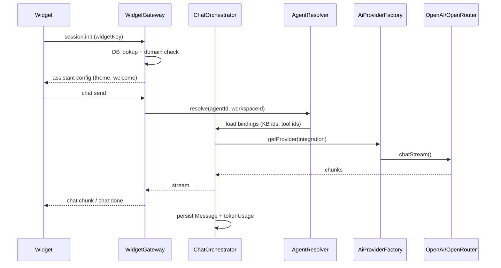

# Phase 1 — AI Integrations + Agents Architecture

> **Workflow:** `@gstack-plan-eng-review`  
> **Date:** 2026-05-20  
> **Prerequisite:** Phase 0 ✅ READY_FOR_PHASE_1  
> **Rule:** Analysis-first. No mocks. No dead routes. No placeholder CRUD.

---

## Step 0 — Scope Challenge

### What the user asked for (Phase 1)

End-to-end production chain:

```
AI Integration → Agent → Assistant → Widget Runtime
```

Six deliverables: Integrations, Model Sync, Agents, Playground, Assistant binding, Widget streaming.

### What already exists (Phase 0)

| Layer | State |
|-------|-------|
| **Monorepo** | turbo + pnpm, 10 packages, 4 apps |
| **DB** | 4 tables: User, Workspace, WorkspaceMember, RefreshToken |
| **Auth** | JWT cookies, refresh rotation, workspace in token, guards |
| **API modules** | auth, workspace, health, realtime (admin + widget gateways) |
| **Web** | Admin shell, RU i18n, dark tokens, **empty states on all feature routes** |
| **Widget** | iframe app, loader, WS connect + ping, **no chat yet** |
| **Worker** | BullMQ health queue only |
| **ai-core** | `AiProviderPort` stub — validateKey + listModels only |
| **crypto** | `EnvelopeEncryptionService` AES-256-GCM per workspace ✅ |
| **vector** | `VectorStorePort` interface, no impl |
| **ui** | Button, Card, Input, Skeleton, EmptyState, design tokens |

### Complexity smell

User Phase 1 spans what ARCHITECTURE.md originally split across Phases 1–4.  
**Risk:** building Assistants + Widget chat without KB ingestion creates “binding UI” without RAG value.

### Recommendation (approved vertical slice)

Deliver **real streaming chat** on the happy path first, defer heavy subsystems:

| In Phase 1 | Deferred (schema-ready, not fake) |
|------------|-----------------------------------|
| OpenAI + OpenRouter adapters (real API) | Anthropic, Gemini, Ollama, Groq, DeepSeek adapters |
| Model sync job + cache + UI badges | Pricing accuracy SLA, hourly sync |
| Agent CRUD + prompt versions + playground | A/B prompt testing |
| Assistant → Agent binding + widget settings | Full KB ingestion (Phase 2) |
| Widget streaming chat (agent-only mode) | RAG in widget (Phase 2, when KB has chunks) |
| Tool **schema** + agent flags | Tool **execution** except playground calculator (Phase 2) |
| AuditLog for agent/integration changes | Full analytics dashboards |

**Iron rule preserved:** Assistant resolves **only** its assigned Agent, KB IDs, Tool IDs at runtime — even if KB/tools are empty, queries are scoped.

---

## 1. Current Architecture Analysis

### 1.1 Package dependency graph (today)

```
apps/api ──┬── @botme/database
           ├── @botme/shared
           ├── @botme/crypto
           └── (ai-core not wired yet)

apps/worker ── @botme/database, bullmq

apps/web ── @botme/ui, @botme/shared

apps/widget ── @botme/shared, socket.io-client

packages/ai-core ── (standalone, ports only)
packages/crypto ── (standalone, tested)
packages/vector ── (port only)
```

**Gap:** API does not import `@botme/ai-core` yet. Orchestrator does not exist.

### 1.2 Auth boundaries

| Boundary | Mechanism | Gap |
|----------|-----------|-----|
| Admin HTTP | `JwtAuthGuard` → `request.user` with `sub`, `workspaceId`, `role` | ✅ |
| Admin WS `/admin` | JWT from cookie/header, joins `workspace:{id}` room | ✅ |
| Widget WS `/widget` | `widgetKey` query param only | ⚠️ No DB lookup yet — accepts any key |
| RBAC | `RolesGuard` exists, **not applied** to controllers | ❌ Must wire on integration/agent routes |
| Workspace scope | JWT `workspaceId` | ⚠️ No repository base enforcing `where: { workspaceId }` |

**Required for Phase 1:**
- `WorkspaceGuard` — verify resource belongs to JWT workspace
- Apply `@Roles()` on mutations (OWNER/ADMIN for integrations, MEMBER+ for agents)
- Widget: resolve `widgetKey` → `WidgetInstance` → `assistantId` → scoped runtime context

### 1.3 Workspace isolation model

```
JWT.workspaceId ──► all admin queries MUST filter by workspaceId
Widget.widgetKey ──► WidgetInstance.workspaceId ──► Assistant ──► Agent ──► AiIntegration
```

**Never:** return another workspace’s integration secret, agent, or model cache.  
**Never:** decrypt API key outside request handler; decrypt in memory, use, discard.

### 1.4 WebSocket flow (today)

```
Admin:  connect → JWT validate → join workspace room → ping/pong
Widget: connect → widgetKey present → join widget:{key} room → ready stub message
```

**Phase 1 target events (widget namespace):**

| Direction | Event | Purpose |
|-----------|-------|---------|
| C→S | `session:init` | Validate widgetKey + origin, return assistant theme |
| C→S | `chat:send` | `{ conversationId?, message, idempotencyKey }` |
| C→S | `chat:cancel` | Abort active generation |
| S→C | `chat:chunk` | Streaming token delta |
| S→C | `chat:done` | Final message + usage |
| S→C | `chat:error` | User-safe error |

Admin namespace additions:
- `playground:stream` / `playground:chunk` / `playground:done` (authenticated)
- `integration:sync-status` (model sync progress)

### 1.5 Web routes (today)

All feature routes render `FeatureEmptyPage` — **must be replaced** with real pages as modules ship.  
No dead routes: either functional or hidden via `FEATURES.* = false`.

---

## 2. Target Architecture (Phase 1)

### 2.1 Runtime flow



### 2.2 AI provider flow

```typescript
// packages/ai-core — target contracts

interface AiProviderPort {
  validateKey(): Promise<ProviderHealthResult>;
  listModels(): Promise<ModelDefinition[]>;
  chat(request: ChatRequest): Promise<ChatCompletion>;
  chatStream(request: ChatRequest): AsyncIterable<ChatStreamChunk>;
  embeddings(texts: string[], model: string): Promise<number[][]>;
}

interface AiProviderFactory {
  create(provider: AiProviderType, credentials: ProviderCredentials): AiProviderPort;
}
```

**Adapters Phase 1:** `OpenAiAdapter`, `OpenRouterAdapter`  
**Stubs Phase 1:** export `UnsupportedProviderError` for future types (no fake responses)

**OpenRouter specifics:**
- `GET /api/v1/models` → map to `AiModelCache`
- Detect free: `pricing.prompt === "0"` or model id contains `:free`
- Store `context_length`, `architecture.modality`, provider slug

### 2.3 Security architecture

```
API key plaintext (request) 
  → EnvelopeEncryptionService.encrypt(key, workspaceId)
  → Bytes in AiIntegration.encryptedSecret
  → never returned in API responses (mask: sk-...xxxx)

Runtime:
  → decrypt in IntegrationCredentialsService (server-only)
  → pass to adapter constructor
  → no logging of credentials (structured logs redact)
```

| Control | Implementation |
|---------|------------------|
| Encryption | Existing `@botme/crypto` envelope AES-256-GCM |
| Per-workspace DEK | `deriveWorkspaceKey(workspaceId, keyVersion)` ✅ |
| Key rotation | `keyVersion` field + re-encrypt job (Phase 1.5) |
| Frontend | Integration DTO: `{ id, name, provider, status, maskedKey, lastValidatedAt }` |
| Audit | `AuditLog` on create/update/delete integration, agent prompt change |

---

## 3. Database Schema (Phase 1 migration)

New models — production-ready, soft delete, workspace isolation:

### 3.1 Enums

```prisma
enum AiProviderType { OPENAI OPENROUTER ANTHROPIC GEMINI OLLAMA GROQ DEEPSEEK TOGETHER MISTRAL }
enum IntegrationStatus { ACTIVE INVALID DISABLED PENDING_VALIDATION }
enum AgentStatus { ACTIVE ARCHIVED }
enum AssistantStatus { ACTIVE DRAFT ARCHIVED }
enum PlaygroundMessageRole { USER ASSISTANT SYSTEM }
```

### 3.2 Core tables

| Model | Key fields | Indexes |
|-------|------------|---------|
| **AiIntegration** | workspaceId, provider, name, encryptedSecret Bytes, keyVersion, isDefault, status, lastValidatedAt, deletedAt | `@@unique([workspaceId, provider, name])`, `@@index([workspaceId, deletedAt])` |
| **AiModelCache** | integrationId, externalId, displayName, contextWindow, promptPrice, completionPrice, supportsTools/Vision/Reasoning, isFree, syncedAt | `@@unique([integrationId, externalId])`, `@@index([integrationId, isFree])` |
| **Agent** | workspaceId, integrationId, modelId, temperature, topP, maxTokens, systemPrompt, safetySettings Json, streamingEnabled, toolsEnabled, embeddingsModel?, status, activePromptVersionId, deletedAt | `@@index([workspaceId, deletedAt])` |
| **AgentPromptVersion** | agentId, version Int, content Text, createdBy, createdAt | `@@unique([agentId, version])` |
| **Assistant** | workspaceId, agentId, name, avatarUrl, welcomeMessage, behavior Json, escalation Json, leadCapture Json, status, deletedAt | `@@index([workspaceId, deletedAt])` |
| **AssistantRuntimeSettings** | assistantId (1:1), theme Json, widgetPosition, language, typingIndicator, offlineMessage | PK assistantId |
| **AssistantKnowledgeBase** | assistantId, kbId | binding only — KB table Phase 2 |
| **AssistantTool** | assistantId, toolId | binding only — Tool table Phase 2 |
| **WidgetInstance** | workspaceId, assistantId, publicKey unique, name, isActive, deletedAt | `@@index([publicKey])` |
| **WidgetDomain** | widgetId, domain | `@@unique([widgetId, domain])` |
| **Conversation** | workspaceId, assistantId, widgetId, visitorId, status | widget chat persistence |
| **Message** | conversationId, workspaceId, role, content, tokenUsage Json | |
| **AuditLog** | workspaceId, userId, action, resource, resourceId, metadata Json | `@@index([workspaceId, createdAt])` |
| **PlaygroundSession** | workspaceId, agentId, userId, createdAt | ephemeral admin tests |

**Relations:** Workspace has many AiIntegration, Agent, Assistant, WidgetInstance.

**Note:** `KnowledgeBase` + `Tool` tables referenced by binding join tables can be minimal stubs in Phase 1 migration (id + workspaceId + name only) **if** assistant binding UI requires them — otherwise join tables store nullable kbId with FK added in Phase 2.  
**Recommendation:** Add stub `KnowledgeBase` / `Tool` models now to avoid fake binding UI; empty KB = zero chunks, orchestrator skips RAG.

---

## 4. API Modules Plan

### 4.1 Module structure (NestJS)

```
apps/api/src/modules/
├── integration/          # NEW
│   ├── application/      IntegrationService, ModelSyncService
│   ├── infrastructure/   IntegrationRepository, OpenRouterClient
│   └── presentation/     IntegrationController
├── agent/                # NEW
│   ├── application/      AgentService, PlaygroundService
│   └── presentation/     AgentController, PlaygroundController
├── assistant/            # NEW
│   └── ...
├── widget-runtime/       # NEW (public + admin)
│   └── presentation/     WidgetPublicController, WidgetChatGateway (extend widget.gateway)
└── orchestration/        # NEW (shared chat logic)
    └── ChatOrchestrator, AgentResolver, StreamRegistry (cancel)
```

### 4.2 HTTP routes (all real, no stubs)

| Method | Route | Auth | Description |
|--------|-------|------|-------------|
| GET | `/integrations` | JWT | List workspace integrations (masked) |
| POST | `/integrations` | JWT ADMIN+ | Create + validate key + encrypt |
| PATCH | `/integrations/:id` | JWT ADMIN+ | Update name/default |
| POST | `/integrations/:id/validate` | JWT ADMIN+ | Re-test key |
| POST | `/integrations/:id/sync-models` | JWT ADMIN+ | Enqueue/trigger model sync |
| GET | `/integrations/:id/models` | JWT | Cached models with pricing |
| GET/POST/PATCH/DELETE | `/agents` | JWT | Agent CRUD |
| GET | `/agents/:id/versions` | JWT | Prompt version history |
| POST | `/agents/:id/versions` | JWT | New prompt version |
| POST | `/playground/sessions` | JWT | Start playground session |
| WS | `/admin` event `playground:send` | JWT | Stream playground chat |
| GET/POST/PATCH | `/assistants` | JWT | Assistant CRUD |
| POST | `/assistants/:id/bindings` | JWT | Set KB + tool IDs |
| GET/POST/PATCH | `/widgets` | JWT | Widget instances + domains |
| GET | `/public/widget/:publicKey/init` | widgetKey+origin | Bootstrap config (REST fallback) |

### 4.3 Worker queues (Phase 1)

| Queue | Job | Trigger |
|-------|-----|---------|
| `integration.sync-models` | Fetch models from provider, upsert AiModelCache | Manual + after create |
| `integration.validate` | Async key validation | Optional background |

Chat streaming stays **in API process** (not worker) for latency; worker only for sync.

---

## 5. Frontend Plan

### 5.1 Replace empty states (order)

1. **`/admin/integrations`** — provider cards (OpenAI, OpenRouter), add-key modal, model browser with badges  
2. **`/admin/agents`** — agent list + editor drawer  
3. **`/admin/agents/:id/playground`** — premium chat UI (not textarea+button)  
4. **`/admin/assistants`** — binding panel (agent select, KB multi-select, tools)  
5. **`/admin/widgets`** — embed code, domain allowlist, live preview iframe  

### 5.2 Playground UX requirements

- Streaming markdown renderer with cursor
- Model picker (from synced cache)
- Latency badge (TTFT ms)
- Token usage footer (prompt/completion/total)
- Cancel button → `AbortController` → WS cancel event
- System prompt editor (collapsible panel, monospace)
- Version selector (prompt history)
- Empty/error states with RU copy

### 5.3 Design system extensions (`@botme/ui`)

Add for Phase 1:
- `Badge` (free model, provider, status)
- `GlassPanel`, `DataRow`, `FormField`
- `StreamingMessage`, `ModelPicker`, `UsageMeter`
- Framer Motion page transitions (web only)

Tokens already match spec (`#39ff14` neon, glass backgrounds).

### 5.4 Responsive breakpoints

Mobile-first layouts for all new pages at: **320, 375, 390, 430, 768, 1024, 1440**.

Playground: single column on mobile; sidebar collapses to bottom sheet.

---

## 6. Widget Runtime Plan

### 6.1 Isolation guarantees

| Check | Where |
|-------|-------|
| widgetKey → single WidgetInstance | WidgetGateway session:init |
| WidgetInstance.assistantId fixed | No client override |
| Assistant.agentId fixed | AgentResolver |
| KB IDs from AssistantKnowledgeBase only | Orchestrator |
| Domain allowlist | WidgetDomain table + origin header |
| Rate limit | Redis sliding window per widgetKey + IP |

### 6.2 Widget app changes

- Replace stub with chat UI (minimal bundle, no admin deps)
- `session:init` → theme CSS variables from AssistantRuntimeSettings
- Streaming message list + input
- Mobile fullscreen via existing loader postMessage
- Reconnect: resume conversationId from sessionStorage

---

## 7. Implementation Phases (execution order)

### Milestone M1 — Schema + Security Foundation (3–4 days)

- [ ] Prisma migration: all Phase 1 models
- [ ] `WorkspaceScopedRepository` base class
- [ ] Wire `RolesGuard` globally on new modules
- [ ] `IntegrationCredentialsService` (encrypt/decrypt wrapper)
- [ ] Unit tests: crypto roundtrip, repository scoping

**Gate:** `@gstack-review`

### Milestone M2 — AI Integrations + Model Sync (4–5 days)

- [ ] Expand `packages/ai-core` ports (chat, stream, embeddings)
- [ ] `OpenAiAdapter`, `OpenRouterAdapter`, `AiProviderFactory`
- [ ] Integration CRUD API + validate endpoint
- [ ] Model sync service + worker job
- [ ] Web: integrations page (real CRUD)
- [ ] Integration tests with real API keys (env-gated)

**Gate:** `@gstack-review` + `@gstack-qa` on integrations UI

### Milestone M3 — Agents + Playground (5–6 days)

- [ ] Agent CRUD + prompt versioning + audit log
- [ ] `ChatOrchestrator` (non-widget path first)
- [ ] Playground WS streaming on `/admin`
- [ ] Web: agent editor + playground premium UX
- [ ] Cancel generation + token usage tracking

**Gate:** `@gstack-review` + `@gstack-qa` playground mobile

### Milestone M4 — Assistants + Bindings (3–4 days)

- [ ] Assistant CRUD + runtime settings
- [ ] Binding join tables (agent required; KB/tools optional empty)
- [ ] `AgentResolver` enforces binding graph
- [ ] Web: assistant wizard

**Gate:** `@gstack-review`

### Milestone M5 — Widget Runtime (5–6 days)

- [ ] WidgetInstance + domain CRUD
- [ ] Extend WidgetGateway: session:init, chat:send/stream/cancel
- [ ] Conversation + Message persistence
- [ ] Widget app chat UI + streaming
- [ ] E2E: embed → chat → response from real provider

**Gate:** `@gstack-review` + `@gstack-qa` widget isolation tests

### Milestone M6 — Hardening (2–3 days)

- [ ] Rate limits on chat + integrations
- [ ] Error sanitization (no provider stack traces to client)
- [ ] `pnpm typecheck && test && lint && validate:foundation`
- [ ] Phase 1 validation report

**Gate:** `@gstack-qa` full pass

**Total estimate:** ~22–28 dev days (single engineer), parallelizable across 3 lanes:

| Lane | Owner focus |
|------|-------------|
| A | packages/ai-core + integration module + worker sync |
| B | agent + orchestrator + playground |
| C | web UI + widget runtime |

---

## 8. Hard Rules Checklist (enforced per PR)

- [ ] No mock provider responses
- [ ] No hardcoded model lists (always from sync or live validate)
- [ ] No API key in logs/responses
- [ ] Every query includes `workspaceId`
- [ ] Widget cannot specify agentId/kbId in payload
- [ ] Strict TypeScript, zero `any`
- [ ] Zero console errors in dev
- [ ] Routes either work or `FEATURES.* = false`

---

## 9. Deliverable Report (pre-implementation baseline)

### 9.1 Architecture status

| Component | Phase 0 | Phase 1 target |
|-----------|---------|----------------|
| Auth + workspace | ✅ Production | Maintain |
| ai-core | 10% (ports stub) | 90% (2 adapters + factory) |
| Integrations API | 0% | 100% |
| Agents + playground | 0% | 100% |
| Assistants | 0% | 90% (no RAG content) |
| Widget chat | 5% (WS ping) | 85% (streaming, no RAG) |
| KB / Tools execution | 0% | 10% (binding schema only) |

### 9.2 Runtime flow

Foundation validated. Phase 1 adds orchestration layer between WS/HTTP and provider adapters with conversation persistence.

### 9.3 AI provider flow

Factory pattern with port interface; OpenAI and OpenRouter as first adapters; others throw `UnsupportedProviderError` at factory level (honest, not fake).

### 9.4 Security audit (pre-implementation)

| Area | Status | Phase 1 action |
|------|--------|----------------|
| Envelope encryption | ✅ Implemented | Wire to AiIntegration |
| Key rotation | ⚠️ Schema only | Add re-encrypt job M6 |
| Widget origin check | ⚠️ CORS only | DB domain allowlist |
| RBAC | ⚠️ Guard exists, unused | Apply to all mutations |
| SSRF (future tools) | N/A | URL blocklist in Phase 2 |
| Prompt injection | N/A | System prompt guidelines M3 |

### 9.5 DB schema audit

Current: 4 tables, pgvector enabled, no AI entities.  
Phase 1 migration adds ~12 models, all with `workspaceId` or FK chain to workspace.

### 9.6 Widget isolation audit

Current: **weak** — any widgetKey connects.  
Phase 1: **strong** — DB-backed key, domain allowlist, assistant-scoped orchestrator context.

### 9.7 Production readiness

| Phase | Score |
|-------|-------|
| Phase 0 complete | 91% |
| Phase 1 after M1 | ~93% |
| Phase 1 complete (M1–M6) | **~96%** (KB RAG deferred) |

### 9.8 Remaining risks

| Risk | Severity | Mitigation |
|------|----------|------------|
| Scope creep (KB/tools) | High | Binding-only until Phase 2 |
| OpenRouter model API drift | Medium | sync-models job + cachedAt UI |
| Streaming memory leaks | Medium | StreamRegistry + cancel on disconnect |
| Provider rate limits | Medium | Exponential backoff, user-visible errors |
| Playground cost | Low | Workspace-level usage tracking in Message.tokenUsage |
| Widget bundle size | Medium | No admin/ui imports in widget |

### 9.9 NEXT PHASE recommendation

After Phase 1 sign-off:

**Phase 2 — Knowledge Base + RAG**
- KbDocument ingestion pipeline (worker)
- PgVectorStore implementation
- RAG_SEARCH tool execution
- Enable KB-backed answers in widget + playground

---

## 10. GSTACK Review Report

| Review | Trigger | Status | Findings |
|--------|---------|--------|----------|
| Plan Eng Review | `@gstack-plan-eng-review` | ✅ COMPLETE | This document |
| Implementation Review | After each milestone | PENDING | M1 not started |
| QA | Before merge | PENDING | — |

**VERDICT:** Plan approved for implementation. **Start with M1 (schema + security foundation).**  
**Do not** begin UI or adapters until migration and `WorkspaceScopedRepository` land.

---

## Appendix A — File touch list (reference)

```
packages/database/prisma/schema.prisma          # migration
packages/ai-core/src/                           # ports, adapters, factory
packages/shared/src/integrations.ts             # Zod schemas, DTO types
apps/api/src/modules/integration/                 # new
apps/api/src/modules/agent/                       # new
apps/api/src/modules/assistant/                   # new
apps/api/src/modules/orchestration/               # new
apps/api/src/modules/realtime/widget.gateway.ts   # extend
apps/worker/src/jobs/sync-models.ts               # new
apps/web/src/pages/integrations/                  # new
apps/web/src/pages/agents/                        # new
apps/web/src/pages/assistants/                    # new
apps/widget/src/                                  # chat UI
```

---

## Appendix B — Environment variables (Phase 1)

No new secrets required beyond Phase 0. Integration API keys stored per-workspace in DB.

Optional dev:
```bash
OPENAI_API_KEY=         # only for local adapter tests (prefer workspace integration)
OPENROUTER_API_KEY=     # same
RUN_PROVIDER_TESTS=1    # gate live provider integration tests
```
